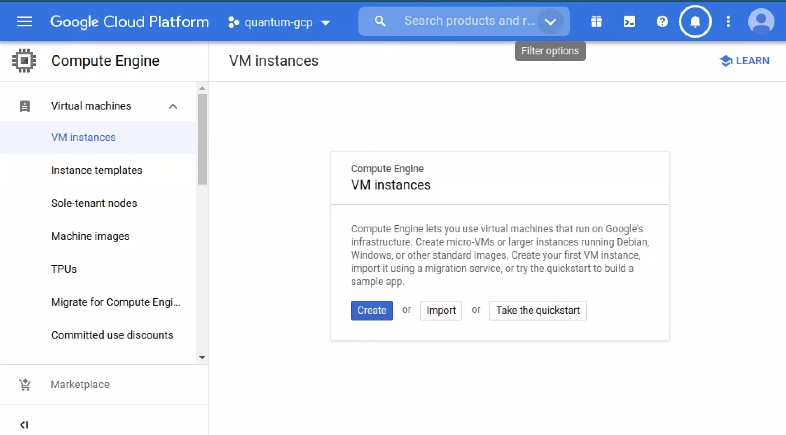
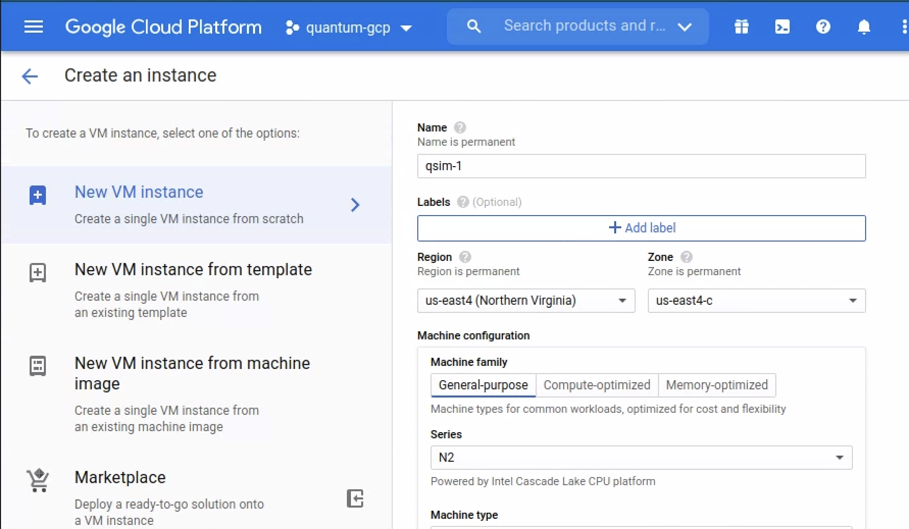
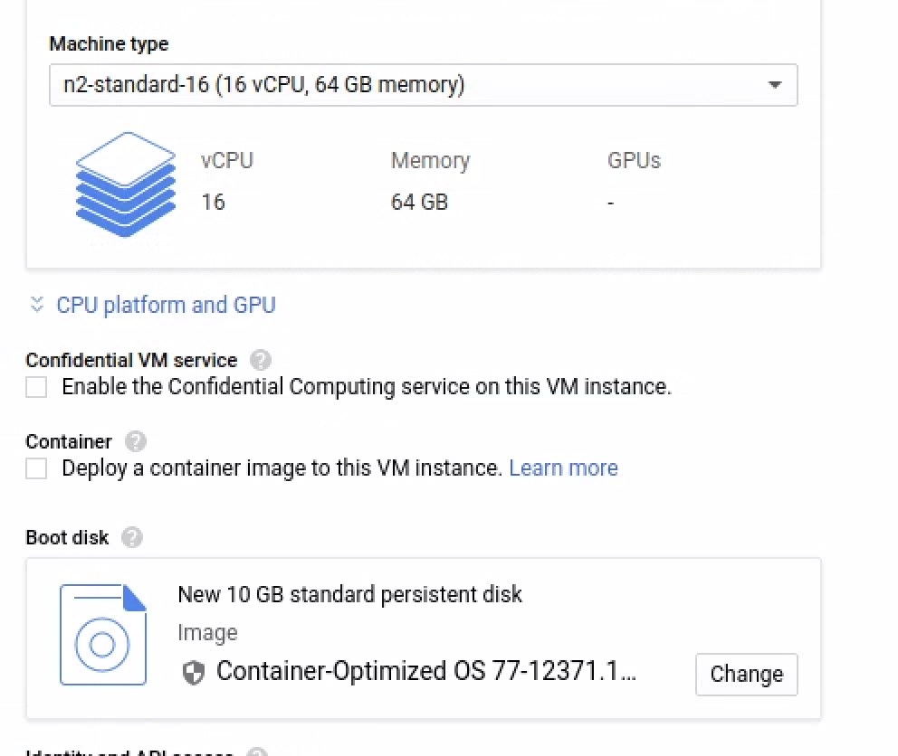
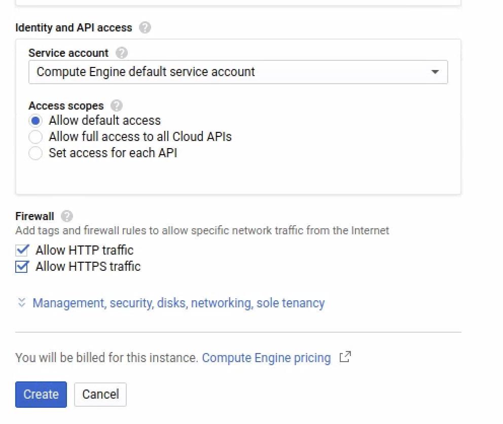
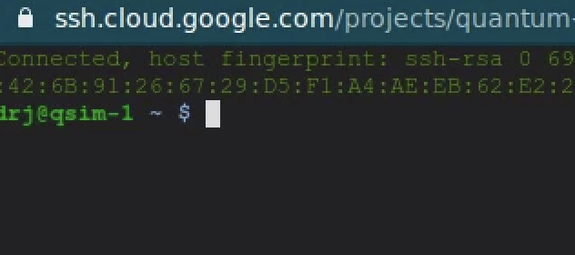
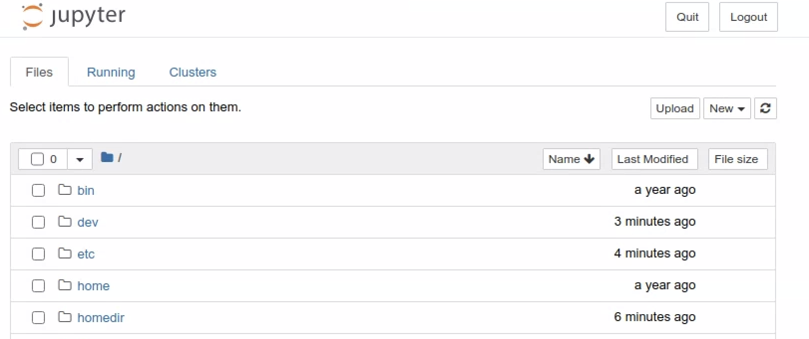
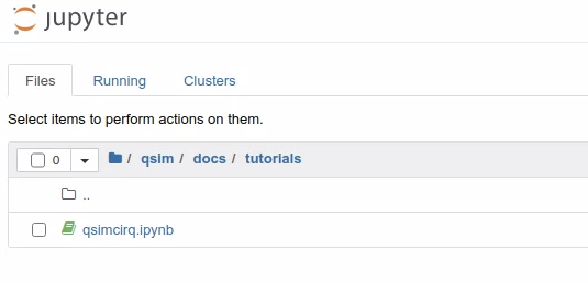
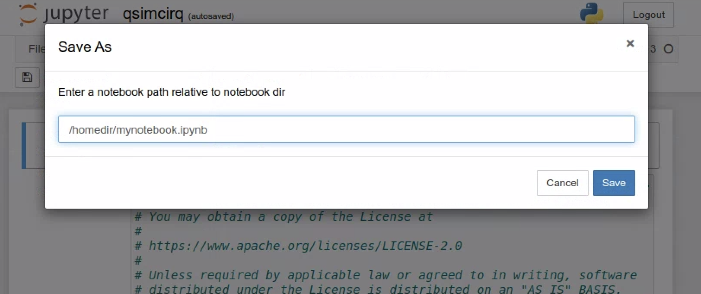
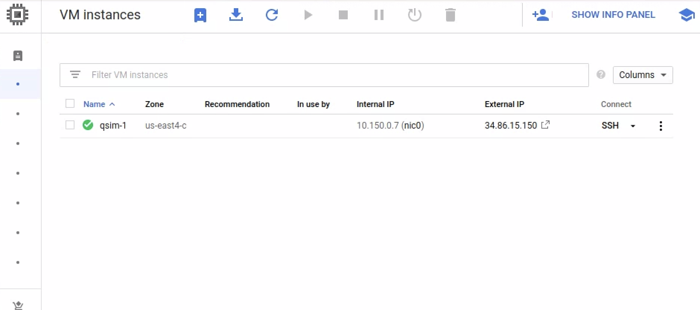

# Quantum simulation on GCP with _Cirq_ and _qsim_


This tutorial will demonstrate how to run [Cirq](https://cirq.readthedocs.io/en/latest/index.html) on Google Cloud Platform. This tutorial will walk through how to install Cirq within a Docker container on a GCE Virtual Machine and view results. You will run simulation both in a Jupyter environment and interactively within the container.

Explaining the concepts of quantum computing is beyond the scope of this tutorial, but many excellent references and texts exist. This website describes [Cirq](https://Cirq.readthedocs.io/en/stable/index.html) in detail. Additionally,  the textbook “Quantum Computation and Quantum Information” by Nielsen and Chuang is an excellent reference.

------


## Objectives

*   Create a Container Optimized VM
*   Run Docker container with Jupyter and qsim installed
*   Run a demo circuit

----


## Costs

This tutorial uses billable components of Google Cloud Platform, including:


*   Compute Engine

Use the [Pricing Calculator](https://cloud.google.com/products/calculator) to generate a cost estimate based on your projected usage.


## Before you begin

These are the steps to follow to get started with this tutorial:


*   Creating a Cloud Platform project
*   Enabling billing for the project
*   Enable Google Compute Engine API

For this reference guide, you need a Google Cloud [project](https://cloud.google.com/resource-manager/docs/cloud-platform-resource-hierarchy#projects). You can create a new one, or select a project you already created:


1. Select or create a Google Cloud project.

> [GO TO THE PROJECT SELECTOR PAGE](https://console.cloud.google.com/projectselector2/home/dashboard)


2. Enable billing for your project.

> [ENABLE BILLING](https://support.google.com/cloud/answer/6293499#enable-billing)

When you finish this tutorial, you can avoid continued billing by deleting the resources you created. See [Cleaning up](#cleaning-up) for more detail.


## Creating a GCE VM 

Once you have a project enabled with a billing account, you will be able to create resources. The key resource required for this project is a Virtual Machine (VM) used to run the qsim quantum simulations. 


### Use the Cloud Console

Connect to the Cloud Console and make sure your current project is selected. Then click on "Create" for a new VM instance:





### Build a Container Optimized VM

To create the VM use the steps in sequence below:


*   Change the name of the VM to be something meaningful like "qsim-1".
*   Choose a Region and Zone
    *   The values are not too important now, but for latency and availability [you may make different choice](https://cloud.google.com/compute/docs/regions-zones#available).
*   Choose the machine family / series: N2
    *   Quantum simulation can require a high level of resources, so we are selecting powerful processors, but [many choices are available.](https://cloud.google.com/blog/products/compute/choose-the-right-google-compute-engine-machine-type-for-you)





*   Choose the [Machine Type](https://cloud.google.com/blog/products/compute/choose-the-right-google-compute-engine-machine-type-for-you): n2-standard-16
    *   16 CPUs
    *   64GB memory
*   Choose the Boot Disk image:[ Container-Optimized OS](https://cloud.google.com/container-optimized-os/docs/concepts/features-and-benefits)
    *   Leave the remaining as defaults.





Finally, enable HTTP access
*   Click "Create"




## Running the qsim docker container

There are two ways to run qsim from this container: from a Jupyter Notebook and interactively from a shell. In both cases, you need to connect to the VM you created above.


### Open a SSH window to your VM

Once VM is created you can connect via [SSH](https://cloud.google.com/compute/docs/ssh-in-browser) to your newly created simulation VM. The easiest is to click the SSH button in the console from the **Compute Engine** -> **VM Instances** page:


You will have a popup window connecting you to the simulation VM. You should have a command prompt:





Start the container:


```console
    $ docker run -v `pwd`:/homedir -p 8888:8888 gcr.io/quantum-builds/github.com/quantumlib/jupyter_qsim:latest
```


The output will be something like:


```console
 Unable to find image 'gcr.io/quantum-291919/jupyter_qsim:latest' locally
 latest: Pulling from quantum-291919/jupyter_qsim
 3c72a8ed6814: Pull complete 
 2bd71a698eae: Pull complete 
 Digest: sha256:d0d0040c6ef9925719459e736631c9fec957b94d377009c591d6285143ebb626
 ...    
     To access the notebook, open this file in a browser:
         file:///root/.local/share/jupyter/runtime/nbserver-1-open.html
     Or copy and paste one of these URLs:
         http://79804d33f250:8888/?token=d7a53e728e3dff08c6ed12a15810471486b4c15828a3d70a
      or http://127.0.0.1:8888/?token=d7a53e728e3dff08c6ed12a15810471486b4c15828a3d70a
```


Copy the last URL (it starts with `127.0.0.1`). Replace `127.0.0.1` with the IP address of the VM 


[created above](#build-a-container-optimized-vm): 


```console
 http://[EXTERNAL_IP_ADDRESS]:8888/?token=7191178ae9aa4ebe1698b07bb67dea1d289cfd0e0b960373
```


Paste that in your browser. You should now see the Jupyter UI:





Navigate to  qsim > docs > tutorials. You will see:





Click on qsimcirq.ipynb. This will load the notebook.

You can skip the setup and go straight to the cell labeled "Full state-vector simulation":


If you choose to modify the notebook, you can save it on the *qsim-1* VM from *File* -> *Save As*, and saving to `/homedir/mynotebook.ipynb`.  This will save in your home directory on your VM, if your directory is open to write.





## Run interactively

To run interactively within the container, you can open a second shell window to the VM as you did [above](#open-a-ssh-window-to-your-vm).

Now, find the container ID with docker ps:


```
$ docker ps
```


The `CONTAINER_ID` is a UID something like "79804d33f250". Now you can connect to the container:


```console
    $ docker exec -it [CONTAINER_ID] /bin/bash
```


This shell is running inside the container, with Python3, Cirq and qsim installed. Start python3:


```console
	$ python3
```


You will see the output:


```python
    Python 3.6.8 (default, Apr 16 2020, 01:36:27) 
    [GCC 8.3.1 20191121 (Red Hat 8.3.1-5)] on linux
    Type "help", "copyright", "credits" or "license" for more information.
    >>>
```


You are now ready for an interactive session running qsim.


### Build the circuit

To import the libraries and build the circuit, copy and paste following into the VM window.


```python
    import cirq
    import qsimcirq

    # Pick a qubit.
    qubit = cirq.GridQubit(0, 0)

    # Create a circuit
    circuit = cirq.Circuit(
       cirq.X(qubit)**0.5,  # Square root of NOT.
    )
    print("Circuit:")
    print(circuit)
```


You should see the output as 

```console

(0, 0): ───X^0.5───

```


### Run the circuit

Now to see what the circuit does when under qsim. Again, copy the following into your VM window:


```python
    simulator = qsimcirq.QSimSimulator()
    result = simulator.simulate(circuit)
    print("Result:")
    print(result)
```


The output will be:


```console
    measurements: (no measurements)
    output vector: (0.5+0.5j)|0⟩ + (0.5-0.5j)|1⟩
```


You have successfully simulated a quantum circuit on Google Cloud Platform using a Singularity container.


### Running your own script

If you want to run a Python script, you can locate a file in the home directory on your VM, then run something like in the container shell

```console
    $ python3 /homedir/myscript.py
```


### Exit the container

Exit the container by typing cntl-d twice. You will see the output like:


```console
    [root@79804d33f250 /]# exit
```


-----


## Cleaning up

To avoid incurring charges to your Google Cloud Platform account for the resources used in this tutorial:


### Delete the VM

It is usually recommended to delete the entire project you created for this tutorial, but if you want to continue using the project, you can easily either STOP the VM or Delete it. Select the VM, the either select the STOP square, or the DELETE trash can.





### Delete the project

The easiest way to eliminate billing is to delete the project you created for the tutorial.

**Caution**: Deleting a project has the following effects:

*   **Everything in the project is deleted.** If you used an existing project for this tutorial, when you delete it, you also delete any other work you've done in the project.
*   **Custom project IDs are lost.** When you created this project, you might have created a custom project ID that you want to use in the future. To preserve the URLs that use the project ID, such as an **```appspot.com```** URL, delete selected resources inside the project instead of deleting the whole project.

If you plan to explore multiple tutorials and quickstarts, reusing projects can help you avoid exceeding project quota limits.

1. In the Cloud Console, [go to the **Manage Resources** page](https://console.cloud.google.com/iam-admin/projects)
2. In the project list, select the project that you want to delete and then click **Delete** 


3. In the dialog, type the project ID and then click **Shut down** to delete the project.

----


## What's next

Additional tutorial examples are available here:


*   [Cirq examples](https://cirq.readthedocs.io/en/stable/examples.html)
*   [Getting started with qsimcirq](https://github.com/quantumlib/qsim/blob/master/docs/tutorials/qsimcirq.ipynb)

Try out other Google Cloud Platform features for yourself. Have a look at our [tutorials](https://cloud.google.com/docs/tutorials).
